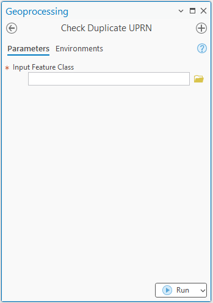

# ឧបករណ៍សម្រាប់ឆែកលេខក្បាលដីស្ទួន
## សេចក្តីផ្តើម
ក្នុងការងារគ្រប់គ្រងទិន្នន័យក្បាលដី លេខក្បាលដីជាព័ត៌មានមួយដ៏សំខាន់បំផុត សម្រាប់បញ្ជាក់អត្តសញ្ញាណនៃក្បាលដី។ ការគ្រប់គ្រងក្បាលដី ត្រូវផ្តោតសំខាន់លើរឿងមួយចំនួនដូចជា

- Field Format
- លេខក្បាលដី
- លេខកូដភូមិ
- លេខសម្គាល់ក្បាលដី
- កាលបរិច្ឆេទបញ្ចូលព័ត៌មាន
- ឈ្មោះអ្នកគូស ឬឈ្មោះម្ចាស់ដីជាដើម

??? question "មិនយល់ ឬមិនស្គាល់ធាតុខាងលើ?"
    - Field Format : សំដៅលើ Attribute Field សំខាន់ៗនៃទិន្នន័យក្បាលដី ដែលជាតម្រូវការ និងទាមទារចាំបាច់ពី [ក្រសួងរៀបចំដែនដី នគរូបនីយកម្ម និងសំណង់ (MLMUPC)]
    - កូដភូមិ : គឺជាផ្នែកមួយនៃប្រព័ន្ធសំគាល់ផ្នែករដ្ឋបាលនៅកម្ពុជា។ កូដនេះត្រូវបានបែងចែកជាចំនួនគ្នាពីរដើម្បីតំណាងឱ្យកម្រិតរដ្ឋបាលផ្សេងៗ ចាប់ពីខេត្តរហូតដល់ភូមិ។ ខាងក្រោមនេះ គឺជាការរបៀបនៃការបែងចែកលេខកូដរដ្ឋបាលនៃប្រទេសកម្ពុជា៖

        * កូដខេត្ត: លេខពីរដំបូងតំណាងឱ្យខេត្ត។
        * កូដស្រុក: លេខពីរបន្ទាប់តំណាងឱ្យស្រុកក្នុងខេត្ត។
        * កូដឃុំ: លេខពីរបន្ទាប់តំណាងឱ្យឃុំក្នុងស្រុក។
        * កូដភូមិ: លេខពីរចុងក្រោយតំណាងឱ្យភូមិជាក់លាក់ក្នុងឃុំ។

        ឧទាហរណ៍៖ លេខកូដ ០៦០២០៨០៣ ជាលេខកូដសម្គាល់ភូមិមួយឈ្មោះ ភូមិឬស្សីជះ ឃុំត្បែង ស្រុកកំពង់ស្វាយ ខេត្តកំពង់ធំ

        * ០៦: [ខេត្តកំពង់ធំ]
        * ០២: [ស្រុកកំពង់ស្វាយ]
        * ០៨: [ឃុំត្បែង]
        * ០៣: ភូមិឬស្សីជះ
    
    [ក្រសួងរៀបចំដែនដី នគរូបនីយកម្ម និងសំណង់ (MLMUPC)]: https://mlmupc.gov.kh/
    [ស្រុកកំពង់ស្វាយ]: https://km.wikipedia.org/wiki/ស្រុកកំពង់ស្វាយ
    [ខេត្តកំពង់ធំ]: https://km.wikipedia.org/wiki/ខេត្តកំពង់ធំ
    [ឃុំត្បែង]: https://km.wikipedia.org/wiki/ឃុំត្បែង(ស្រុកកំពង់ស្វាយ)
    
    - លេខក្បាលដី ([UPRN]) ជាលេខកំណត់ពីលេខអត្តសញ្ញាណជាក់លាក់​ និង មានតែមួយគត់(Unique) នៃក្បាលដីក្នុងយុទ្ធនាការចុះបញ្ជីក្បាលដីមានលក្ខណៈជាប្រព័ន្ធ
    - លេខសម្គាល់ក្បាលដី ជាការផ្គុំឡើងដោយតម្លៃលេខកូដភូមិ និងលេខក្បាលដី ដោយប្រើប្រាស់សញ្ញាដក '-'។
    - កាលបរិច្ឆេទបញ្ចូលព័ត៌មាន ជាកាលបរិច្ឆេទដែលព័ត៌មានក្បាលដីត្រូវបានបញ្ចូល
    - ឈ្មោះអ្នកគូស ឬឈ្មោះម្ចាស់ដីជាដើម

    [UPRN]: https://en.wikipedia.org/wiki/Unique_Property_Reference_Number

ក្រៅពីការគ្រប់គ្រងទិន្នន័យក្នុង [តារាង Attribute] អ្នកគ្រប់គ្រងទិន្នន័យក៏ត្រូវគ្រប់គ្រងទៅលើភាពត្រឹមត្រូវលើលក្ខណៈធរណីមាត្ររបស់ទិន្នន័យក្បាលដីផងដែរ។ ការពិនិត្យលើភាពត្រឹមត្រឹមនៃលក្ខណៈធរណីមាត្រក្បាលដី សំដៅមួយផ្នែកលើការគ្រប់គ្រង់ទៅលើភាពគង ឬចន្លោះរវាងក្បាលដីនិងក្បាលដី របស់ក្បាលដីក្នុងភូមិ និងឆ្លងភូមិជាដើម។ល។

ការពិនិត្យលើលេខក្បាលដីស្ទួននៅក្នុងភូមិ ជាចំនុចសំខាន់មួយដែរនៅក្នុងការងារគ្រប់គ្រងក្បាលដី។ បើសិនជាមានលេខក្បាលដីស្ទួន ហើយអ្នកគ្រប់គ្រងមានការឆកល្វែងក្នុងការពិនិត្យ វានឹងនាំឲ្យមានការរាំងស្ទះ ដល់ការវិនិច្ឆ័យ ក្នុងដំណើរការចុះបញ្ជីដីធ្លីមានលក្ខណៈជាប្រព័ន្ធ។ ការពិនិត្យលើមើលលេខក្បាលដីស្ទួនក្នុង [តារាង Attribute] នៃទិន្នន័យក្បាលដីដោយផ្ទាល់ មិនអាចធ្វើទៅបានទេ ដោយសារកម្មវិធី [ArcGIS Pro] មិនបានផ្តល់នូវមុខងារនោះដល់អ្នកប្រើប្រាស់។ យ៉ាងណាមិញ យើងប្រើប្រាស់កម្មវិធីខាងក្រៅដូចជា [Microsoft Excel] ជាជំនួយបាន។

??? question "ចង់ចេះឆែកលេខស្ទួនដោយប្រើ Excel?"
    ងាយទេ!! យើងអាចឆែកបាន ដោយប្រើប្រាស់មុខងារ [Conditional Formatting] ដោយចម្លងតារាងទិន្នន័យពី Attribute ទៅដាក់ក្នុង Excel ហើយជ្រើសរើសជួរឈរ ដែលផ្ទុកលេខក្បាលដី រួចចូលទៅកាន់ [Conditional Formatting] >> Highlight Cells Rules >> Duplicate Values..

[តារាង Attribute]: https://support.esri.com/en-us/gis-dictionary/attribute-table
[Microsoft Excel]: https://en.wikipedia.org/wiki/Microsoft_Excel
[Conditional Formatting]: https://support.microsoft.com/en-us/office/use-conditional-formatting-to-highlight-information-in-excel-fed60dfa-1d3f-4e13-9ecb-f1951ff89d7f

ការប្រើប្រាស់កម្មវិធី Excel អាចជួយបានក៏ពិតមែន តែវានៅតែមានការលំបាកដដែល នៅក្នុងករណីមានទិន្នន័យច្រើន។ អាស្រ័យហេតុនេះ [Khmer GRS Academy] បានបង្កើតនូវឧបករណ៍មួយ ប្រើប្រាស់ដើម្បីសម្រួលដល់ការឆែកលេខស្ទួននេះបានយ៉ាងងាយ។

[Khmer GRS Academy]: https://www.khmergrs.com/

## អំពីឧបករណ៍ឆែកលេខក្បាលដី

ផ្ទៃមុខរបស់ឧបករណ៍

## ទាញយកឧបករណ៍
ដើម្បីអាចប្រើប្រាស់ឧបករណ៍នេះបាន លោកអ្នកអាចចុចទាញយកឧបករណ៍ស្រាប់ឆែកលេខក្បាលដីស្ទួន សម្រាប់កម្មវិធី [ArcMap] ឬ [ArcGIS Pro] បានតាមរយៈតំណភ្ជាប់ខាងក្រោមនេះ

- [សម្រាប់កម្មវិធី ArcMap]
- [សម្រាប់កម្មវិធី ArcGIS Pro]

    [ArcMap]: https://desktop.arcgis.com/en/arcmap/latest/map/main/what-is-arcmap-.htm#:~:text=ArcMap%20represents%20geographic%20information%20as,symbol%20legend%2C%20and%20so%20on.
    [ArcGIS Pro]: https://www.esri.com/en-us/arcgis/products/arcgis-pro/overview
    [សម្រាប់កម្មវិធី ArcMap]: https://t.me/khmergisacademychannel/386
    [សម្រាប់កម្មវិធី ArcGIS Pro]: https://t.me/khmergisacademychannel/386

## របៀបប្រើប្រាស់
ទស្សនាវីដេអូខាងក្រោមអំពីរបៀបប្រើប្រាស់ឧបរកណ៍

<iframe src="https://www.facebook.com/plugins/video.php?height=476&href=https%3A%2F%2Fwww.facebook.com%2Fkhmergisacademy%2Fvideos%2F942118084777875%2F&show_text=false&width=380&t=0" width="380" height="476" style="border:none;overflow:hidden" scrolling="no" frameborder="0" allowfullscreen="true" allow="autoplay; clipboard-write; encrypted-media; picture-in-picture; web-share" allowFullScreen="true"></iframe>